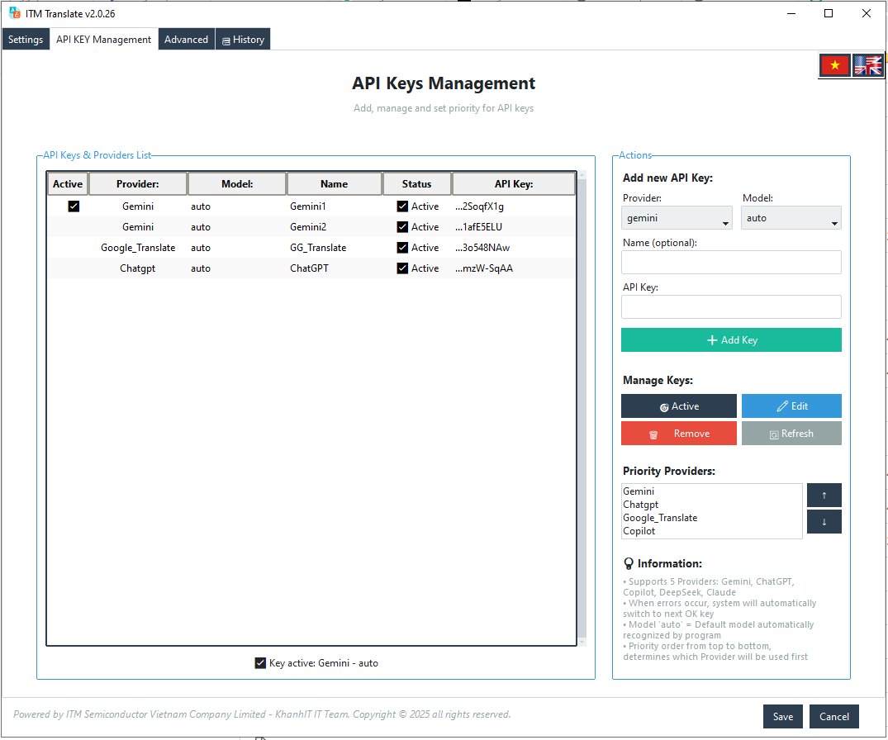
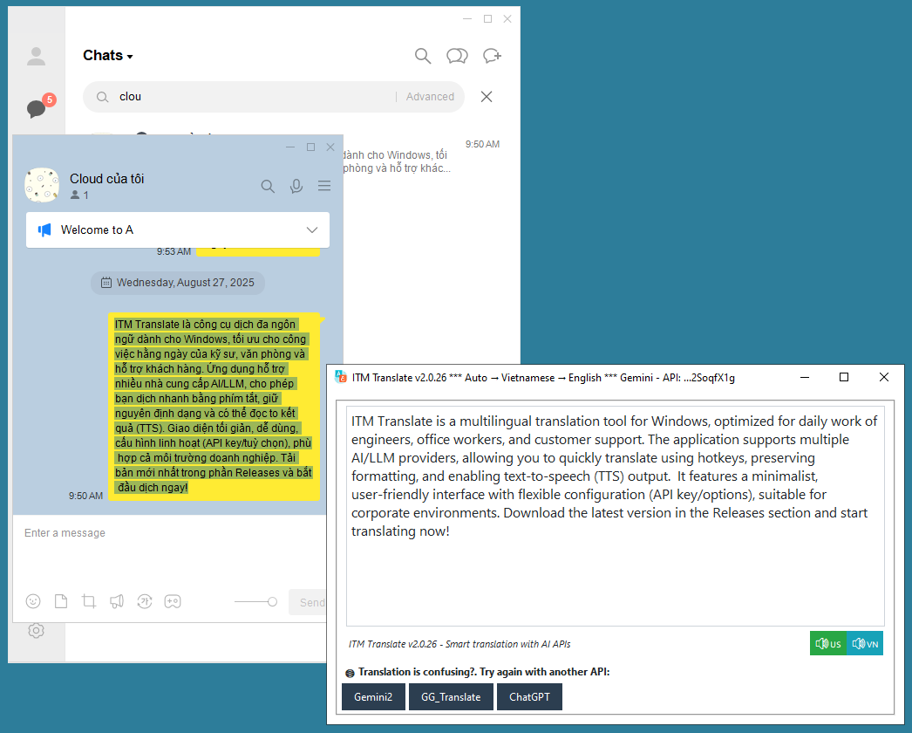
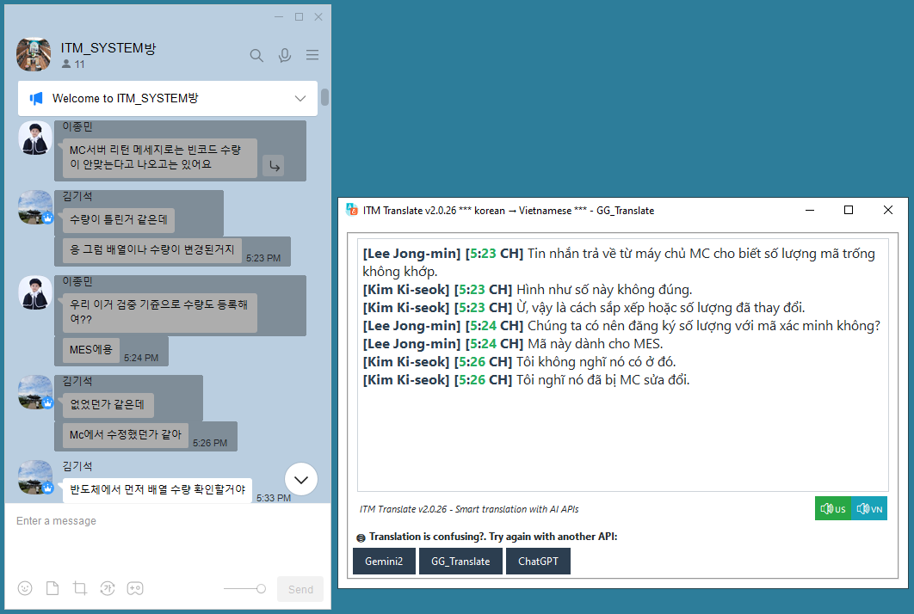

# ITM Translate

> 🌐 **Ngôn ngữ:** [English Version](README.en.md)

**Phần mềm dịch thuật thông minh với AI API**

Dịch văn bản nhanh chóng bằng phím tắt, hỗ trợ dịch các ngôn ngữ một cách tự nhiên.

## ✨ Tính năng chính

- 🔤 **Dịch nhanh**: Chọn văn bản và nhấn phím tắt để dịch tức thì
- 🔊 **Text-to-Speech**: Đọc bản dịch bằng giọng nói
- 🎯 **Subtitle Sync**: Highlight từng từ khi đọc
- 🤖 **Multi-AI**: Hỗ trợ Gemini, ChatGPT, Claude, DeepSeek và Google Translate với failover tự động
- 🌍 **Đa ngôn ngữ**: Tự động nhận diện và dịch sang nhiều ngôn ngữ
- ⚡ **Hotkey**: Phím tắt tùy chỉnh (đề xuất Ctrl+Q, Ctrl+D hoặc Ctrl+1, Ctrl+2)

## 🚀 Tải về & Cài đặt

- Download bản cài Windows (.exe) từ trang [GitHub Releases](https://github.com/quockhanh112hubt/ITM_Translate/releases/download/Setup/ITM_Translate_Setup_v2.0.25.exe)
- Sau khi cài đặt, khởi chạy chương trình và làm theo hướng dẫn ở Tab Nâng Cao > Hướng dẫn sử dụng

## 🖼️ Ảnh chụp màn hình / Demo

## 🚦 Thiết lập API Key
1. Mở chương trình → Tab "Quản lý API KEY"
2. Thêm API key từ một trong các providers:
   - **Gemini** (khuyến nghị): [Google AI Studio](https://aistudio.google.com/)
   - **ChatGPT**: [OpenAI API](https://platform.openai.com/api-keys)
   - **Claude**: [Anthropic Console](https://console.anthropic.com/)
   - **DeepSeek**: [DeepSeek Platform](https://platform.deepseek.com/)

Lưu ý: API keys chỉ lưu cục bộ trên máy. Nếu bạn khoá/thu hồi key, cập nhật trong app để tránh lỗi.

## 🧭 Cách dùng
1. **Dịch popup**: Chọn văn bản → Nhấn `Ctrl+Q`
2. **Dịch thay thế**: Chọn văn bản → Nhấn `Ctrl+D`
3. **Text-to-Speech**: Nếu muốn nghe bản dịch. Click nút 🔊 trong popup
4. **Tùy chỉnh**: Tab "Cài Đặt" để thay đổi hotkey và ngôn ngữ

## ❓ Hỗ trợ & FAQ
- **Hotkey không hoạt động**: thử chạy app với quyền Administrator hoặc kiểm tra phần mềm hotkey khác gây xung đột
- **API key lỗi**: kiểm tra key trong tab "Quản lý API KEY"
- **Không có giọng đọc**: cài đặt Windows Speech Platform / kiểm tra voice pack

Q: Có thể sử dụng miễn phí không? A: Có, nhưng cần API keys từ các providers (một số có tier miễn phí)

Q: Hỗ trợ offline translation? A: Không, cần internet để kết nối với AI providers

Q: Có giới hạn độ dài text? A: Mỗi provider có giới hạn khác nhau (~4000-8000 ký tự)

Q: Có mobile app? A: Chưa, hiện tại chỉ hỗ trợ Windows desktop

---

### Liên hệ:
- **GitHub Issues**: [Báo lỗi tại đây](https://github.com/quockhanh112hubt/ITM_Translate/issues)
- **Developer**: KhanhIT - ITM Semiconductor Vietnam

---
*Copyright © 2025 ITM Semiconductor Vietnam Company Limited*
